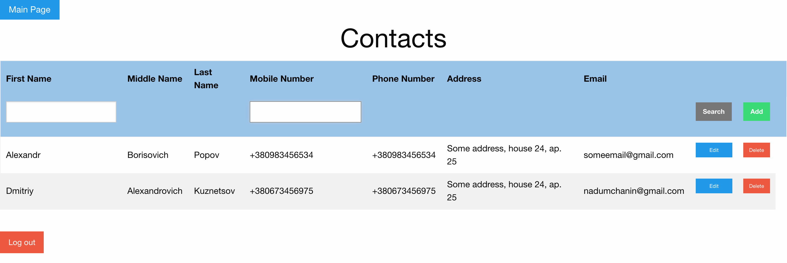
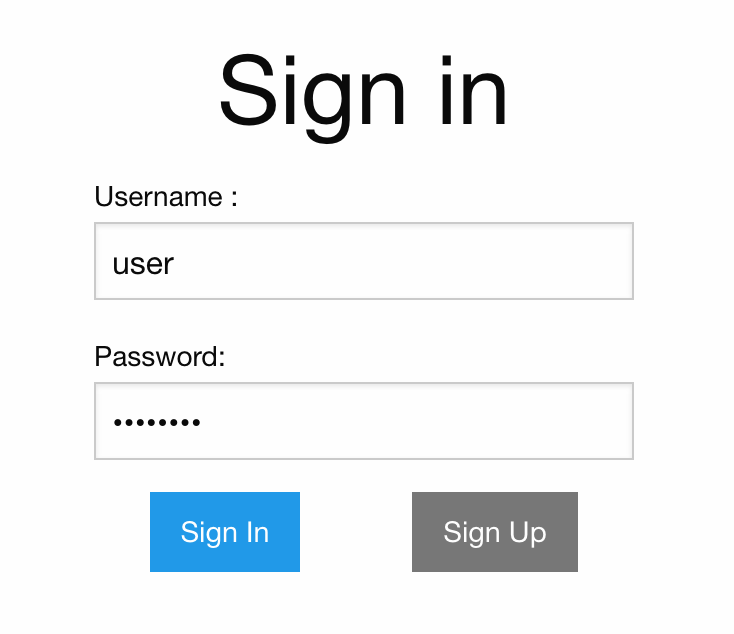

PhoneBook is my freelance project. 
Main features: 
  * ability to keep separate contact list for each registered client
  * ability to perform CRUD operations with client's contacts
  * ability to search by name/number for incomplete words/numbers
  * ability to save only those recordings which are valid
  * ability to redirect to main page if client is not signed in / signed up
  * ability to have multiple datasources (MySQL + JSON)

Technologies used: Srping Boot, Spring IoC, Spring MVC, Spring Data JPA, Spring Security, Jackson, Mockito, JUnit, Foundation 

To run application, please execute the following command in Maven:

1) MySQL profile: spring-boot:run -Dspring.profiles.active=local -Duser.impl="userDaoMySql" -Dcontact.impl="contactDaoMySql"
2) Jackson profile: spring-boot:run -Dspring.profiles.active=local -Duser.impl="userDaoFile" -Dcontact.impl="contactDaoFile"

Scripts to Create MySQL Database Phonebook :

CREATE SCHEMA `Phonebook`;

CREATE TABLE `Users` (
  `id` int(11) unsigned NOT NULL AUTO_INCREMENT,
  `login` varchar(20) NOT NULL DEFAULT '',
  `password` varchar(20) NOT NULL DEFAULT '',
  `first_name` varchar(30) DEFAULT NULL,
  `middle_name` varchar(30) DEFAULT NULL,
  `last_name` varchar(30) DEFAULT NULL,
  PRIMARY KEY (`id`)
) ENGINE=InnoDB DEFAULT CHARSET=latin1;

CREATE TABLE `Contacts` (
  `id` int(11) unsigned NOT NULL AUTO_INCREMENT,
  `users_id` int(11) unsigned NOT NULL,
  `first_name` varchar(30) NOT NULL DEFAULT '',
  `middle_name` varchar(30) NOT NULL DEFAULT '',
  `last_name` varchar(30) NOT NULL DEFAULT '',
  `mobile_number` varchar(13) NOT NULL DEFAULT '',
  `phone_number` varchar(13) DEFAULT NULL,
  `address` varchar(70) DEFAULT '',
  `email` varchar(30) DEFAULT '',
  PRIMARY KEY (`id`),
  KEY `users_id_fk` (`users_id`),
  CONSTRAINT `users_id_fk` FOREIGN KEY (`users_id`) REFERENCES `Users` (`id`)
) ENGINE=InnoDB DEFAULT CHARSET=latin1;

